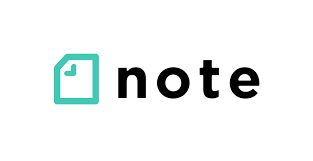
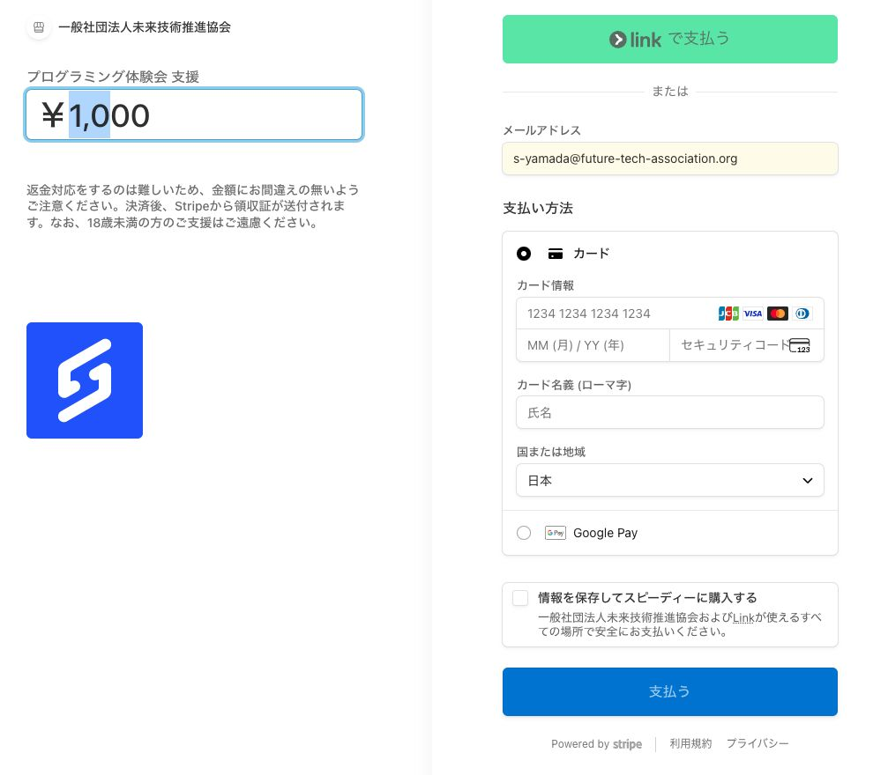
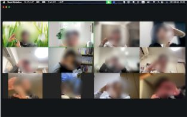
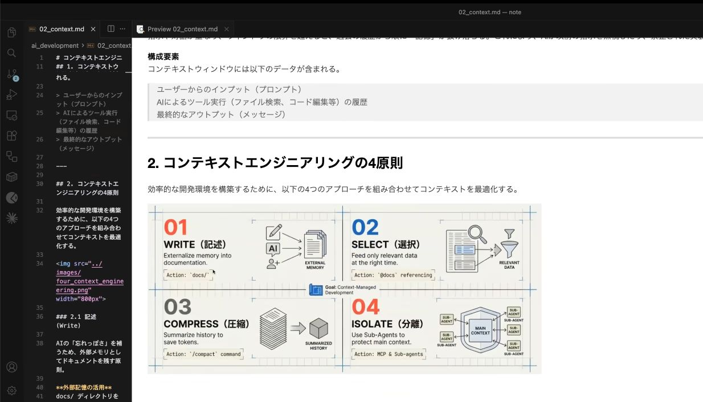
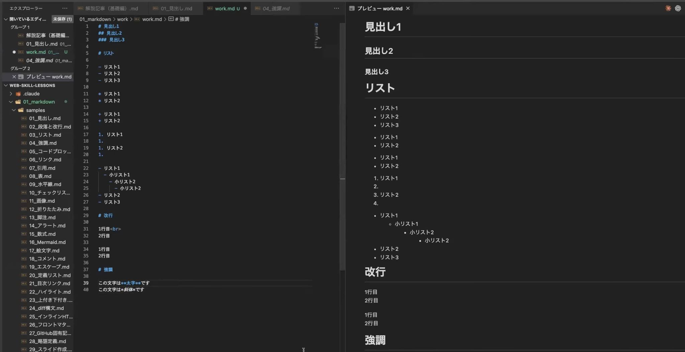
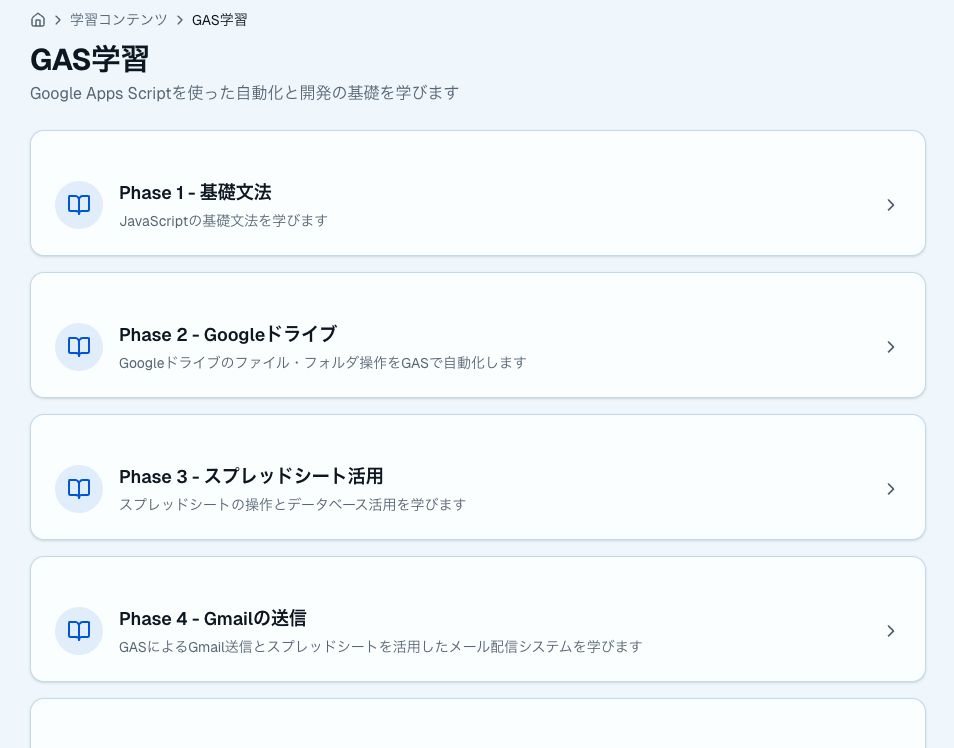
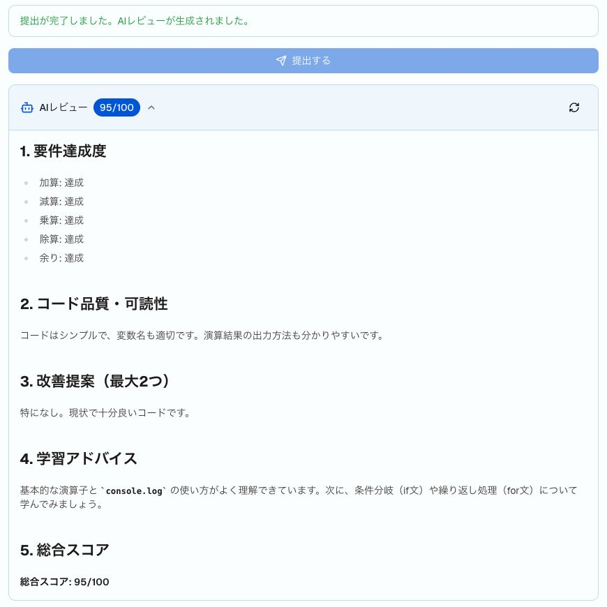

<!-- _paginate: skip -->
<!-- _footer: '' -->

## 過去体験会の情報は各種SNSでも公開中です

様々なSNSを通じてプログラミングのスキルアップに役立つ情報を発信中！！

| X | note | YouTube |
|---|---|---|
| <br>イベント情報 / スキルアップ情報 | <br>Web/AI開発の技術記事 | <br>AI技術・GAS 動画配信 |

- **Xアカウント**：https://x.com/helloCodeSchool
- **noteアカウント**：https://note.com/hello_coding
- **YouTubeアカウント**：https://www.youtube.com/@エンジニアチャンネル

<!--
チャットや口頭でアカウントを案内するときの控え。
X：https://x.com/helloCodeSchool
note：https://note.com/hello_coding
YouTube：https://www.youtube.com/@エンジニアチャンネル
-->

---

<!-- _paginate: skip -->
<!-- _footer: '' -->

## イベント開始前のご案内

- 本体験会は録画いたしますのでご了承ください
- 講師からの問いかけには、了解(👍)や挙手(✋)などのスタンプで応答のご協力をお願いいたします
- 不明点や原因不明のエラーが出た場合、チャットでお気軽にご質問ください（エラー内容付きで）
- 本内容はnoteやYouTubeでも公開しているので、ぜひご活用ください。

<!--
開始直後に読む。録画の了承 → スタンプでの応答 → チャット質問（エラー内容付き）→ 公開先、の順。
-->

---

<!-- _paginate: skip -->
<!-- _footer: '' -->
<!-- _class: pair -->

## AI駆動開発 体験会のご支援のお願い

AI駆動開発 体験会を継続するためにご支援をお願いいたします

- 金額は任意で設定可（500円以上）
- Stripeによる安全な決済
- 決済方法：クレジットカード・Google Pay・Apple Pay
- 入力頂いたメールアドレス宛に領収書を送付

<p class="fig">

決済用リンク
</p>

<!--
決済URL（チャット貼り付け用）：https://buy.stripe.com/6oUbJ1ePw5TMgh0eQe0Fi0c
任意・500円以上。クレジットカード / Google Pay / Apple Pay。領収書は入力メール宛。
-->

---

<!-- _class: lead -->
<!-- _paginate: false -->
<!-- _footer: '' -->

<p class="kicker">2026.09.07 ｜ ハンズオン（約60分）</p>

# ウェブサイトの公開方法

> Claude Code で作ったページに<br>"自分だけのURL"を

<p class="org">シンギュラリティ・ラボ</p>

<!--
企画 Issue：https://github.com/Singuralitylabs/tech-share/issues/2
狙い：Claude Code で作ったページを、"自分だけのURL"として世界に公開する、までを全員が体験（または視聴）して持ち帰る。
通しのメッセージ：公開は"作る→確かめる→公開→更新"の4ステップ。難しいのは仕組みではなく"公開前チェック"。
ハンズオンは2ルート制：メインは GitHub Pages（ルートA）。GitHub未準備・認証トラブルの人は Netlify Drop（ルートB）で、全員が当日中にURLへ到達する。
各パートの型：たとえ（荷物・お店・住所・玄関）で直感 → 実際の画面、の順で統一。
数字の扱い：1パートにつき「覚えて帰る数字/エピソード」は1つに絞る。
参加形態：Claude Pro 契約者は手を動かす／未契約者は講師画面の実演を視聴。講師が常に1テンポ先を実演し、視聴だけでも流れが完結して分かる構成。
対象：エンジニア〜非エンジニア混在。
-->

---

<!-- _header: 'PART 01 · オープニング' -->

## 今日のゴールは、"自分だけのURL"

- 今日のゴールは1つ：**自分の作ったページに、世界中どこからでも開けるURLが付く**こと
- Pro 契約の方は一緒に手を動かします。未契約の方は講師画面で同じ流れを追体験
- 流れが分かれば、後日1人でもできます

> この会が終わる頃、皆さんのスマホで**お互いのページを開き合える**

<!--
今日のゴールは1つ：自分の作ったページに、世界中どこからでも開けるURLが付くこと。
全体像（作る→確かめる→公開→更新）は次の1枚で焼き付ける。
Pro 契約の方は一緒に手を動かす。未契約の方は講師画面で同じ流れを追体験 → 流れが分かれば後日1人でできる。
覚えて帰る絵はこれ1つ：「この会が終わる頃、皆さんのスマホでお互いのページを開き合える」。
-->

---

<!-- _class: flow -->
<!-- _header: 'PART 01 · オープニング' -->

## 作る → 確かめる → 公開 → 更新

1. **作る**
   Claude Code に自己紹介ページを作ってもらう
2. **確かめる**
   自分の目で見て、公開前チェック
3. **公開**
   みんなが見える場所に置いて、URLをもらう
4. **更新**
   直して、もう一度反映する

<!--
4ステップの地図はこの後全パートで再掲する"背骨"。ここで1枚図として焼き付ける。
今日はこの4ステップを1周する。公開はゴールではなく、更新まで含めて1周。
3分で切り上げて次へ。自己紹介や前置きを長くしない。
-->

---

<!-- _class: grid -->
<!-- _header: 'PART 02 · 公開の仕組み' -->

## 公開＝ファイルを"みんなが見える場所"に置くこと

- **ファイル＝荷物**
  - 自分のPCの中にあるうちは、自分しか見えない
- **サーバー＝お店**
  - 24時間開いている、みんなが見える場所
- **URL＝住所**
  - 引っ越し（アップロード）すると、住所が発行される

<!--
「公開」とは何か：自分のPCの中のファイルは自分しか見えない → "みんなが見える場所（サーバー）"にファイルを置くと、住所（URL）経由で誰でも見られる。
たとえで統一：ファイル＝荷物、サーバー＝24時間開いているお店、URL＝住所。引っ越し（アップロード）すると住所が発行される。
DNS・HTTP等の用語は出さない。図1枚（次スライド：PC→サーバー→URL→他人のスマホ）で押し切る。
覚えて帰る一言：「皆さんが毎日見ているWebページも、全部"誰かが置いたただのファイル"」。普段のネット閲覧と今日やることが同じ仕組みだと気づかせる。
-->

---

<!-- _class: flow -->
<!-- _header: 'PART 02 · 公開の仕組み' -->

## URLを開く＝「この住所のファイルをください」

1. **自分のPC**
   作ったファイルは、まだ自分だけのもの
2. **サーバーへ置く**
   みんなが見えるお店に引っ越す
3. **URLが付く**
   住所が発行される
4. **誰かのスマホ**
   住所を頼むと、ファイルが届く

<!--
ブラウザで URL を打つ＝「この住所のファイルをください」とお願いしているだけ。魔法ではない。
PC → サーバー → URL → 他人のスマホ、の順で指差しながら話す。
「皆さんが毎日見ているWebページも、全部"誰かが置いたただのファイル"」。ここで一度言って定着させる。
-->

---

<!-- _header: 'PART 03 · 公開先の選択肢' -->

## 王道は GitHub Pages、"GitHubなし"なら Netlify Drop

| | GitHub Pages | Netlify | Vercel | Cloudflare Pages |
|---|---|---|---|---|
| 料金 | **0円** | 無料枠 | 無料枠 | 無料枠 |
| 置き方 | リポジトリと一体 | D&D / Git | Git連携 | Git連携 |
| 今日 | **メイン** | Dropで代替 | （紹介のみ） | （紹介のみ） |

本格的なアプリになったら、他の選択肢も出てきます。今日は深掘りしません。

<!--
置く場所には選択肢がある。比較表は1枚で流し、個別手順には入らない。
今日のメインは GitHub Pages：①無料 ②ファイル置き場（GitHub）と公開が一体 ③Claude Code との相性（GitHub操作まで任せられる）。
あわせて GitHubなしでも公開できる代表として Netlify Drop を次スライドで重点紹介。
Vercel / Cloudflare / surge 等は表の1行に留め深掘りしない。「本格的なアプリになったら他の選択肢も」と一言だけ。
覚えて帰る数字：「費用はどちらも0円。Netlify Drop はドラッグ&ドロップから数秒でURL発行」。
-->

---

<!-- _class: flow -->
<!-- _header: 'PART 03 · 公開先の選択肢' -->

## GitHubなしなら、Netlify Drop

1. **ドラッグ&ドロップ**
   ブラウザにフォルダを置くだけ。アカウント無しでも即公開
2. **約1時間の期限**
   未登録のままだと、仮のURLは自動削除される
3. **claim する**
   無料登録（メール）して自分のサイトだと宣言すると、URLが残る

<!--
Netlify Drop：ブラウザにフォルダをドラッグ&ドロップするだけ・アカウント無しでも即公開。
ただし未登録のままだと約1時間で自動削除 → 無料登録（メール）して「claim」すればURLを保持。
「claimするまでが公開」と次のハンズオンでも繰り返す。出典は参考スライド。
覚えて帰る数字の後半：ドラッグ&ドロップから数秒でURL発行。
-->

---

<!-- _class: stat -->
<!-- _header: 'PART 03 · 公開先の選択肢' -->

## だから今日のメインは、GitHub Pages

# 0円

- ファイル置き場（GitHub）と公開が**一体**
- Claude Code との相性が良い（GitHub操作まで任せられる）
- URLの形は `https://ユーザー名.github.io/リポジトリ名/`

<!--
①無料 ②ファイル置き場と公開が一体 ③Claude Code との相性。この3つで「だから今日は Pages」と言う。
URLの形をここで予告しておく（個人情報チェックの伏線。ユーザー名がURLに出る）。
費用はどちらも0円、がこのパートの数字。Netlify Drop も0円、と口頭で添える。
-->

---

<!-- _class: center -->
<!-- _header: 'PART 04 · 公開前チェック' -->

## 一度出したページは、"消したつもり"にできない

> 後で消せばいい、は通用しない。
> 誰かに、もう保存されているかもしれない。

- だから公開ボタンの前に、**見られて困るもの**を見る
- ルートA / ルートB、どちらでもチェックは共通です

<!--
今日いちばん持ち帰ってほしいパート。募集ページの必須トピックなので、時間が押しても削らない。
3枚構成の1枚目＝消せない前提。チェックリスト（次）と index.html＝玄関（その次）。
ハンズオン Step 2 でチェックリストを再掲するので「後でもう一度出します」と予告。
取り下げ＝世界から消えた保証ではない、はパート5でも回収する。
-->

---

<!-- _class: grid -->
<!-- _header: 'PART 04 · 公開前チェック' -->

## 公開ボタンの前に、"見られて困るもの"チェック

- **秘密情報・APIキー**
  - プログラムに書いた"合鍵"。公開すると誰でも使える
  - コードに直接書かない。公開フォルダに置かない
- **個人情報**
  - 本名・顔写真・住所・勤務先。**URL にユーザー名も出る**
  - 載せるものは、名刺に書けるものまで
- **消せない前提**
  - 一度公開したものは、誰かに保存されているかもしれない
  - 「後で消せばいい」は通用しない

<!--
チェック3点をこの順で指差す。ルートA/Bどちらでもチェックは共通、と明言。
覚えて帰る数字：GitHub 上では1年間で約3,900万件の秘密情報（APIキー等）の置き忘れが検出されている（GitHub 公表, 2024年）。プロでもやる、だから仕組みで防ぐ。
出典は参考スライドに明記。口頭では「約3,900万件」だけ。
技術面の基本（index.html＝玄関）は次の1枚。
-->

---

<!-- _class: flow -->
<!-- _header: 'PART 04 · 公開前チェック' -->

## index.html は、サイトの"玄関"

1. **住所だけ訪ねる**
   URL を開いた人は、中のファイル名を知らない
2. **玄関を探す**
   サーバーはまず `index.html` を出す
3. **名前を間違えると 404**
   玄関が見つからない＝ページが無いように見える

<!--
index.html はサイトの"玄関"。住所（URL）だけ訪ねてきた人に最初に見せるファイル。
名前を間違えると玄関が見つからず 404 になる。ハンズオン Step 5 の三点確認でも回収する。
たとえ（玄関）→ 実際のファイル名、の順。用語はこれ以上増やさない。
-->

---

<!-- _class: ba -->
<!-- _header: 'PART 05 · 更新と取り下げ' -->

## 更新も取り下げも、"いつでも自分の手で"

| 更新 | 取り下げ |
|---|---|
| 直して再プッシュ（Bは再ドロップ） | Pages を無効化 / サイト削除 |
| **数分で反映**。印刷物と違い、いつでも直せる | **設定1か所**。自分の手でいつでも止められる |

ただし、取り下げ＝世界から消えた保証ではない。だから公開前チェックが効きます。

<!--
公開はゴールではなくスタート。
更新：ファイルを直して再プッシュ（ルートBは再ドロップ）→ 数分で反映。印刷物と違い"いつでも直せる"。
取り下げ：GitHub は Settings → Pages 無効化 or リポジトリ非公開/削除、Netlify はサイト削除。自分の手でいつでも止められると知っておくと安心して公開できる。
ただし前パートの通り、取り下げ＝世界から消えた保証ではない。だから公開前チェックが効く。
覚えて帰る一言：「取り下げは設定1か所、更新はひとこと Claude に頼むだけ」。運用の軽さを数で示す。
-->

---

<!-- _header: 'PART 06 · ハンズオンの進め方' -->

## 作る → 確かめる → 公開 → "自分だけのURL"

| Step | 内容 | ルート |
|---|---|---|
| 0 | 環境確認（`claude` 起動 → `gh auth status`） | ここで **A / B に分岐** |
| 1 | 自己紹介ページを作る | 共通 |
| 2 | ブラウザで確かめる＋公開前チェック | 共通 |
| 3–4 | 公開する | **A** Pages ／ **B** Drop |
| 5 | 自分のURLにアクセス → 見せ合い | **合流** |

- 各ステップ冒頭で講師が先に実演 → 参加者が追いかける
- 視聴のみの方へ：講師画面で全ステップ完走します。**流れを目に焼き付けて持ち帰る**のが今日のミッション。手順スライドは後日配布

<!--
Step 0〜5 の6ステップ。Step 0 の環境確認でルートA（GitHub Pages）／ルートB（Netlify Drop）に分岐。どちらでも今日のゴール（自分だけのURL）に到達できる。
各ステップ冒頭で講師が先に実演 → 参加者が追いかける。
視聴のみの方へ：講師画面で全ステップ完走するので、流れを目に焼き付けて持ち帰るのが今日のミッション。手順スライドは後日配布。
分岐は Step 0 の1回だけ。運営を単純に保つ。
-->

---

<!-- _class: dense -->
<!-- _header: 'PART 07 · ハンズオン / STEP 0' -->

## Step 0｜環境を確認して、ルートを決める

**① 作業フォルダを作り、そこで起動する**

```
claude
```

**② Claude に、これを送る**

```
gh auth status を実行して
```

| 結果 | 今日のルート |
|---|---|
| 認証OK | **ルートA**　GitHub Pages（メイン） |
| 未準備 / NG | **ルートB**　Netlify Drop（GitHubなし） |

ルートBの方は、**メールアドレスが使えること**だけ確認してください。

<!--
このスライドは出しっぱなしにする1枚。参加者が見ながら作業する。
作業フォルダ作成 → claude 起動 → Claude に「gh auth status を実行して」→ 認証OKならルートA、未準備/NGならルートBへ分岐。
gh未認証で当日詰まるのが最大リスク。分岐で「詰まったら終わり」を無くす。
ルートBの人にはメールアドレスだけ確認。可能なら https://app.netlify.com/ の無料登録だけ事前に、と案内済み想定。
講師が常に1テンポ先を実演する。視聴の方もこの分岐の意味だけは持ち帰ってもらう。
-->

---

<!-- _class: dense -->
<!-- _header: 'PART 07 · ハンズオン / STEP 1-2' -->

## Step 1-2｜作って、公開前チェック

**Step 1**　Claude に、これを送る（そのままコピペ）

```
自己紹介ページを作ってください。条件：index.html という名前の1ファイル、HTMLとCSSだけ、外部サービス・APIキーは使わない。内容はニックネーム・趣味・ひとことの3つ。おしゃれなデザインでお願いします。
```

**Step 2**　`index.html` をブラウザで開く → 公開前チェック（パート4の再掲）

- 秘密情報・APIキーは入っていないか（コードに直接書いていないか）
- 個人情報は、名刺に書ける範囲か（URL にユーザー名も出る）
- 一度出すと、消したつもりでも残ることがある

<!--
このスライドは出しっぱなし。同じテキストをチャットにも流す。
凝りすぎ超過がつまずき。プロンプト全文を掲示して統一。「HTML/CSSのみ・1ファイル・index.html」と縛る。
開き方不明 → 「index.html をブラウザで開いて」と Claude に頼めばOK。いちばん確実なのはファイルをダブルクリック。
公開前チェックはルートA/B共通。ここで「後でもう一度出します」と予告したリストを回収する。
許可を聞かれたら y / Enter。巡回時に真っ先に確認する。
-->

---

<!-- _class: dense -->
<!-- _header: 'PART 07 · ハンズオン / ルートA' -->

## ルートA｜GitHub Pages で公開する

**Step 3A**　Claude に、これを送る（そのままコピペ）

```
このフォルダを公開（public）リポジトリ `my-first-page` として GitHub に作成してプッシュしてください。gh コマンドを使ってください。
```

**Step 4A**　触るのは、ここ1か所だけ

> Settings → Pages → Branch: `main` / `(root)` → Save

- 無料アカウントの Pages は **public リポジトリ** が必要（プロンプトに書いてある）
- リポジトリ名は全員 **`my-first-page`**（`ユーザー名.github.io` 型は使わない）

<!--
このスライドは出しっぱなし。ルートAの人の作業カード。
リポジトリ作成・プッシュは Claude（gh CLI）に任せ、Pages 有効化だけは人間がブラウザで行う――「公開する」決断の瞬間を自分の手で押させるため。
無料アカウントの Pages は public 必須 → プロンプトに明記。リポジトリ名は全員統一。ユーザー名.github.io 型は命名ミスの温床なので使わない。
画面迷子がつまずき。講師画面でクリック位置を拡大表示。「触るのはここ1か所だけ」。
Step 4A のスクショは当日までプレースホルダ可。前日リハーサルで実スクショに差し替える。
-->

---

<!-- _class: dense -->
<!-- _header: 'PART 07 · ハンズオン / ルートB' -->

## ルートB｜Netlify Drop で公開する

**Step 3B**　フォルダごとドロップする

> ブラウザで `https://app.netlify.com/drop` を開き、**index.html を含むフォルダごと**ドラッグ&ドロップ

**Step 4B**　claim するまでが、公開

- 無料登録（メールアドレス）してサイトを **claim** する → URLが残る
- **未claimは約1時間で自動削除**される
- メールの確認リンクを、忘れずに踏む

ファイル単体ではなく、**フォルダごと**がポイントです。

<!--
このスライドは出しっぱなし。ルートBの人の作業カード。
ファイル単体でなく index.html を含むフォルダごとドロップ、と口頭でも図でも明示する。
未claimは約1時間で自動削除 → 「claimするまでが公開」と強調。メール確認リンクの踏み忘れに注意。
ルートBのドロップ操作も、Pages 有効化と同じ思想：「公開する」決断を自分の手で。
Step 3B のスクショは当日までプレースホルダ可。前日リハーサルで実スクショに差し替える。
ルートBは先に終わりやすい。終わった人は講師のルートA実演を視聴するか、ページを追加改良。
-->

---

<!-- _class: dense -->
<!-- _header: 'PART 07 · ハンズオン / STEP 5' -->

## Step 5｜自分だけのURLにたどり着く

| ルート | URLの形 |
|---|---|
| A | `https://ユーザー名.github.io/my-first-page/` |
| B | `https://ランダムな名前.netlify.app/` |

**404 のときは、この3点**　① `index.html` の名前　② public か（ルートA）　③ 数分待ったか（Pages は1〜3分）

待ち時間の更新デモ（ルートA・そのままコピペ）

```
ページの背景色をお気に入りの色に変えて、GitHub に反映してください。
```

<!--
このスライドは出しっぱなし。見せ合いまでが今日のゴール。
Pages はビルドに1〜3分 → 待ち時間に講師が更新デモ（プロンプト③）＋取り下げデモ。
ルートBは先に終わるので、講師のルートA実演を視聴 or ページを追加改良。
404は「index.htmlの名前／publicか／数分待ったか」の3点確認。
取り下げデモ：GitHub は Settings → Pages 無効化、Netlify はサイト削除。「設定1か所」を実物で見せる。時間が押したら口頭に降格してよい（削ってよい順②）。
-->

---

<!-- _class: grid -->
<!-- _header: 'PART 08 · クロージング' -->

## 今日、覚えて帰る4つ

- **公開とは**
  - ファイルを、みんなが見える場所に置くこと
- **置き場所**
  - 王道は GitHub Pages。GitHubなしなら Netlify Drop
- **公開前**
  - 見られて困るものチェック（秘密・個人情報・消せない前提）
- **公開後**
  - 更新も取り下げも、いつでも自分の手で

<!--
覚えて帰る4つ＝各パートのひとことを再掲。
①公開＝みんなが見える場所に置く ②王道は GitHub Pages、GitHubなしなら Netlify Drop ③公開ボタンの前に"見られて困るもの"チェック ④更新も取り下げも自分の手で。
ブックエンド。パート2〜5の見出しが1枚に戻ってくる形。
-->

---

<!-- _class: center -->
<!-- _header: 'PART 08 · クロージング' -->

## 今日の1周を、自宅でもう1周

> 手順は資料に残します。当日ルートBだった人も、GitHub Pages に挑戦できます。

- 作る → 確かめる → 公開 → 更新。この4ステップをもう1周
- 次回：9/14（月）20時〜　Web開発講座「可視化Dashboard開発」
- 質問・詰まりは、今からどうぞ

<!--
自宅でもう一周のすすめ：手順スライドを配布するので、当日ルートBだった人も GitHub Pages ルートに挑戦できる。
次回予告は 9/14 の可視化Dashboard。時間が押したら次回予告は割愛してよい（削ってよい順④）。
最後まで到達できなかった人が必ずいるので、「資料に全部残す」を明言してから Q&A。
-->

---

<!-- _class: src -->
<!-- _header: 'APPENDIX · 出典' -->
<!-- _footer: '' -->

## 出典と、困ったとき

- **約3,900万件**（GitHub secret scanning・2024年公表値）
  GitHub Blog <https://github.blog/news-insights/octoverse/octoverse-2024/>
  GitHub Blog <https://github.blog/security/application-security/next-evolution-github-advanced-security/>
- **GitHub Pages**（公式）
  <https://docs.github.com/ja/pages/getting-started-with-github-pages/about-github-pages>
- **Netlify Drop**（公式クイックスタート）
  <https://docs.netlify.com/start/quickstarts/netlify-drop-quickstart/>
  ドロップ先：<https://app.netlify.com/drop>
- **未claimは約1時間で削除**（匿名デプロイの claim 期限）
  Netlify Docs <https://docs.netlify.com/api-and-cli-guides/cli-guides/get-started-with-cli#anonymous-deploys>
- **困ったとき**
  ルートA：リポジトリは public か / Pages の Branch は `main` `(root)` か / 1〜3分待ったか / ファイル名は `index.html` か
  ルートB：フォルダごとドロップしたか / claim したか / 確認メールを開いたか

<!--
出典スライド。本編では数字だけ言い、URLはここに集約。
src 単独（refs と併用しない。font-size が衝突する）。split は使わない（手順の表がはみ出す）。
-->

---

<!-- _paginate: skip -->
<!-- _footer: '' -->
<!-- _class: center -->

## AI駆動開発体験会アンケート

チャットにもURLを貼りますので、ご回答お願いします
（アンケート回答頂いた方には本スライドをお送りします）


<!--
アンケートURL（チャット貼り付け用）：
https://docs.google.com/forms/d/e/1FAIpQLSfJlSsAqvXaS6id-DIRjz9EIsMUYUnYBdpsrXkd1kOEt1i9-Q/viewform?usp=header
回答者に本スライドを送る旨を口頭でも添える。
-->

---

<!-- _paginate: skip -->
<!-- _footer: '' -->
<!-- _class: pair -->

## AI駆動開発体験会のご支援のお願い

本AI駆動開発 体験会を継続するため、ご支援をお願いいたします。

- 金額は任意で設定可（500円以上）
- Stripeによる安全な決済
- 決済方法：クレジットカード・Google Pay・Apple Pay
- 入力頂いたメールアドレス宛に領収書を送付

<p class="fig">

決済用リンク
</p>

<!--
決済URL（チャット貼り付け用）：https://buy.stripe.com/6oUbJ1ePw5TMgh0eQe0Fi0c
opening 3枚目とほぼ同内容。導入文だけ「本〜継続するため、」になっている。
-->

---

<!-- _paginate: skip -->
<!-- _footer: '' -->
<!-- _class: pair -->

## AI駆動開発体験会のご支援のお願い



<p class="fig">

決済用リンク
</p>

<!--
決済画面のスクショ（メールアドレスは公開済みのためマスキングしない）＋同じ決済QR。
決済URL：https://buy.stripe.com/6oUbJ1ePw5TMgh0eQe0Fi0c
-->

---

<!-- _paginate: skip -->
<!-- _footer: '' -->
<!-- _class: pair -->

## 今後のイベントのお知らせ

プログラミング・AI駆動開発体験会

- 9/7 (月) 20時~ AI駆動開発講座 Web公開手法
- 9/14 (月) 20時~ Web開発講座 可視化Dashboard開発

<p class="fig">

申込フォーム
</p>

<!--
差し替え欄：開催日程。転記時に最新の3件へ更新する。見出し「プログラミング・AI駆動開発体験会」と箇条書きの型は残す。
申込URL（チャット貼り付け用）：https://forms.gle/rq9TDREWNbZwoEAW6
差し替え欄を最新化。作成時点（2026-08-23）で未実施の公式日程は 9/7（本発表）と 9/14。8/17 は実施済みのため外した。3件目の公式日程は未確認。
-->

---

<!-- _paginate: skip -->
<!-- _footer: '' -->
<!-- _class: center -->

## シンギュラリティ・ラボとは

> テクノロジーによる<br>社会課題解決を目指すコミュニティ


<!--
コミュニティの一言紹介。写真は集合カット（Singularity Lab の看板）。短く置いて次の「どんなコミュニティなの？」へ渡す。
-->

---

<!-- _paginate: skip -->
<!-- _footer: '' -->
<!-- _class: pair wide -->

## どんなコミュニティなの？

- 会員数は約50名で、技術職・文系職・学生等、多くの職種の方が参加
- 活動目的やペースは各自の自由（アプリ開発、不定期の情報収集など）
- オンライン以外に、ワーケーションや飲み会等のオフライン企画あり

<p class="fig">

オンライン交流会

お花見の様子
</p>

<!--
多様性・各自のペース・オフライン企画の3点。写真はオンライン交流会とお花見。
-->

---

<!-- _paginate: skip -->
<!-- _footer: '' -->
<!-- _class: pair wide -->

## シンラボ活動のご紹介「スキルアップ講座」

**AI技術交流会・AI共有会**
週に1〜2回、生成AIを活用したアプリ開発やAIの活用方法を共有

**Web技術講座**
毎月1回、ハンズオン形式でGitやマークダウン等のWebサービススキルを学ぶ
※アーカイブ動画あり

<p class="fig">

AI技術交流会の解説画面

Web技術講座の解説画面
</p>

<!--
左が講座の説明、右がそれぞれの解説画面。アーカイブ動画があることだけ口頭で添える。
-->

---

<!-- _paginate: skip -->
<!-- _footer: '' -->
<!-- _class: pair wide -->

## シンラボ活動のご紹介「Sinlab Study」

自分のペースで学習するWeb学習支援サービス

**主な機能**

- 動画・スライドでの学習
- 課題提出による実践力強化
- 提出課題のAIレビュー

| デモサイト | 紹介記事 |
|:---:|:---:|
|  |  |

<p class="fig">

フェーズ別画面

AIレビュー画面
</p>

<!--
デモサイト：https://web-skillup-service.vercel.app/demo
紹介記事：https://note.com/hello_coding/n/n48ed56a1bd3c
QRの取り違えに注意（左＝デモサイト / 右＝紹介記事。元PDFの配置）。
-->

---

<!-- _paginate: skip -->
<!-- _footer: '' -->

## 7月の主なシンラボ活動の紹介

- AI駆動開発の解説（AI開発におけるセキュリティ設定）
- Web技術の解説講座（npmパッケージ管理の解説）
- Webアプリのチーム開発
- もくもく会

<!--
差し替え欄：見出しの月と箇条書きの中身を、転記時に直近月の活動へ更新する。箇条書き4項目の型は残す。
本デッキ作成時点で確認できた直近の公式4項目（7月）を掲載。8月分の公式リストは未確認のため、推測で書き換えない。
-->

---

<!-- _paginate: skip -->
<!-- _footer: '' -->

## 会費は？

| 区分 | 金額 |
|---|---|
| 入会費 | 無料 |
| 一般会員 | 3,000円／月（税込、前払い） |
| 学生会員 | 1,500円／月　※高校生、高専生は無料 |

- 支払い方法
  - クレジットカード決済のみ
  - 毎月27日に次月分を自動決済

<!--
料金は表で見せて、支払い条件は箇条書き。学生は高校生・高専生が無料である点を口頭で補う。
-->

---

<!-- _paginate: skip -->
<!-- _footer: '' -->

## 注意すること

- 誹謗中傷や勧誘活動などの、人の嫌がる行為は禁止
- 会員の個人情報の収集や無断での外部への開示は禁止
- 入会時の申告内容に虚偽があったり、会費を2ヶ月滞納した場合は退会となるので注意

<!--
禁止事項は3点だけ。責めずに「これだけ守れば大丈夫」のトーンで読む。
-->

---

<!-- _paginate: skip -->
<!-- _footer: '' -->
<!-- _class: center -->

## 最後に

> シンラボの仲間と一緒に、<br>スキルを高めて新しい価値を<br>創り出していきましょう！

<!--
クロージング。余韻を残して終える。空の split スライドは置かない（Issue #7 決定事項）。
-->
