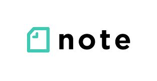
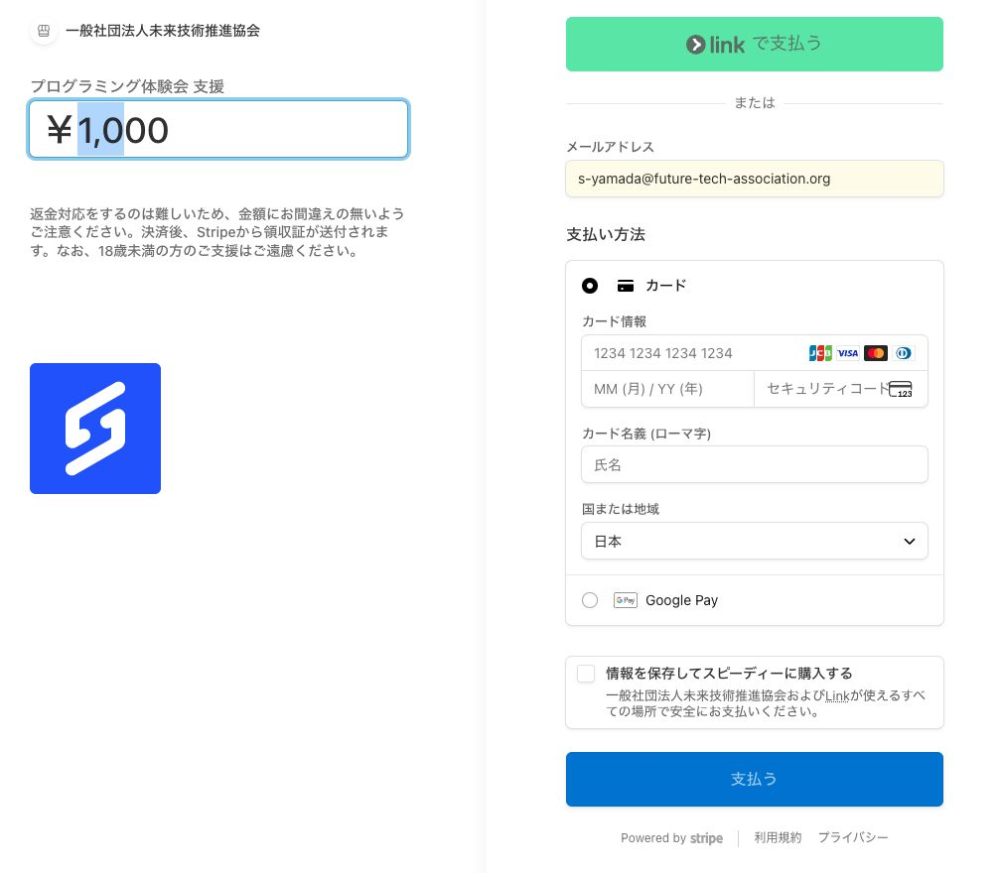
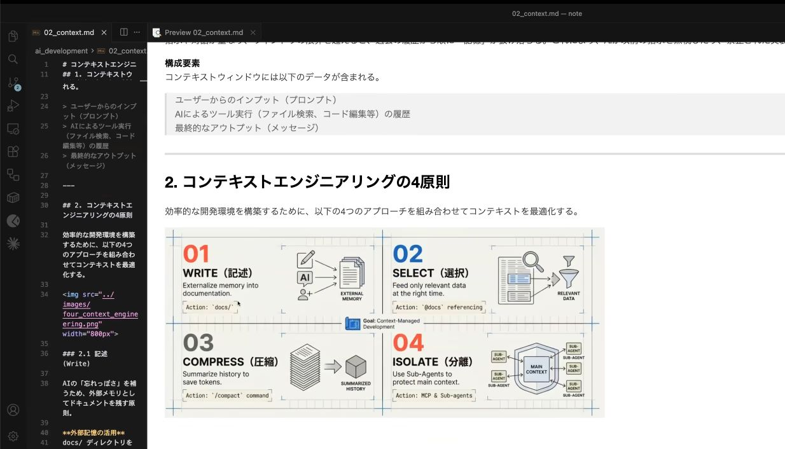
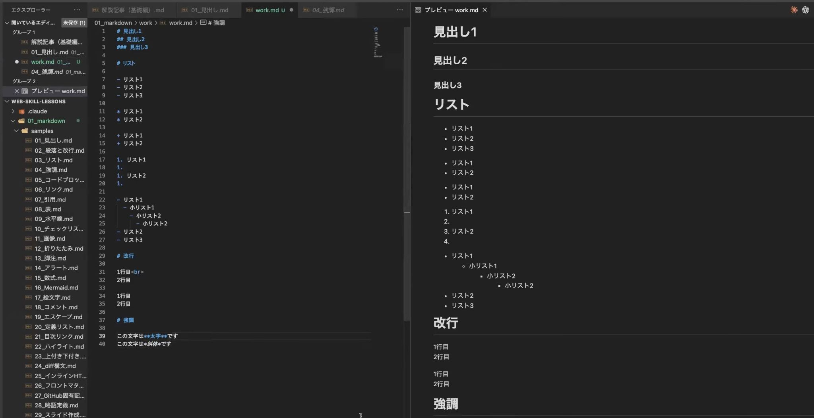
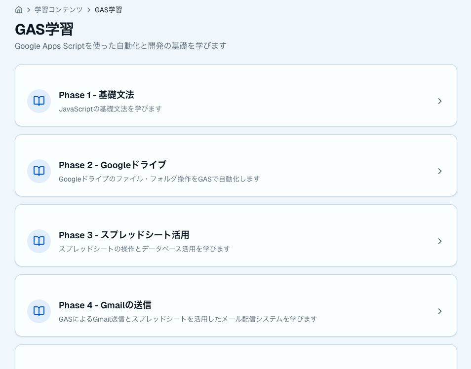
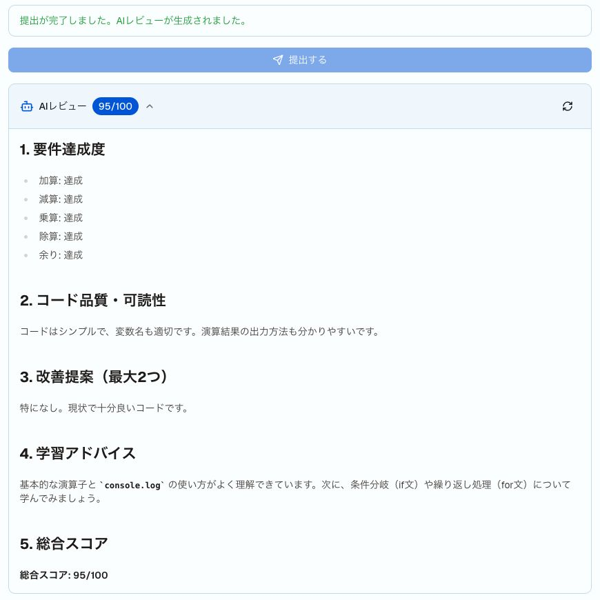

<!-- _paginate: skip -->
<!-- _footer: '' -->

## 過去体験会の情報は各種SNSでも公開中です

様々なSNSを通じてプログラミングのスキルアップに役立つ情報を発信中！！

| X | note | YouTube |
|---|---|---|
| <br>イベント情報 / スキルアップ情報 | <br>Web/AI開発の技術記事 | <br>AI技術・GAS 動画配信 |

- **Xアカウント**：https://x.com/helloCodeSchool
- **noteアカウント**：https://note.com/hello_coding
- **YouTubeアカウント**：https://www.youtube.com/@エンジニアチャンネル

<!--
チャットや口頭でアカウントを案内するときの控え。
X：https://x.com/helloCodeSchool
note：https://note.com/hello_coding
YouTube：https://www.youtube.com/@エンジニアチャンネル
-->

---

<!-- _paginate: skip -->
<!-- _footer: '' -->

## イベント開始前のご案内

- 本体験会は録画いたしますのでご了承ください
- 講師からの問いかけには、了解(👍)や挙手(✋)などのスタンプで応答のご協力をお願いいたします
- 不明点や原因不明のエラーが出た場合、チャットでお気軽にご質問ください（エラー内容付きで）
- 本内容はnoteやYouTubeでも公開しているので、ぜひご活用ください。

<!--
開始直後に読む。録画の了承 → スタンプでの応答 → チャット質問（エラー内容付き）→ 公開先、の順。
-->

---

<!-- _paginate: skip -->
<!-- _footer: '' -->
<!-- _class: pair -->

## AI駆動開発 体験会のご支援のお願い

AI駆動開発 体験会を継続するためにご支援をお願いいたします

- 金額は任意で設定可（500円以上）
- Stripeによる安全な決済
- 決済方法：クレジットカード・Google Pay・Apple Pay
- 入力頂いたメールアドレス宛に領収書を送付

<p class="fig">

決済用リンク
</p>

<!--
決済URL（チャット貼り付け用）：https://buy.stripe.com/6oUbJ1ePw5TMgh0eQe0Fi0c
任意・500円以上。クレジットカード / Google Pay / Apple Pay。領収書は入力メール宛。
-->

---

<!-- _class: lead -->
<!-- _paginate: false -->
<!-- _footer: '' -->

<p class="kicker">2026.10.05 ｜ ハンズオン（約60分）</p>

# CLAUDE.md の活用<br>AIに“申し送り”を書く

<p class="org">シンギュラリティ・ラボ</p>

<!--
企画 Issue：https://github.com/Singuralitylabs/tech-share/issues/13
カリキュラム全体：https://github.com/Singuralitylabs/tech-share/issues/12（2026-10 回）
狙い：「毎回同じ説明をする」を卒業し、自分用の CLAUDE.md と settings を持ち帰る。
通しのメッセージ：申し送りはファイルに書けば、言わなくてよくなる。
対象：Claude Code 初心者（エンジニア〜非エンジニア混在）。インストールと起動確認は事前に済んでいる前提。
開始15分前から接続を開放し、`claude` が起動するかだけ確認してもらう。事前案内で `claude update` も依頼しておく（AGENTS.md は v2.1.277 以降が必要）。
-->

---

<!-- _header: 'OVERVIEW' -->

## 今日のゴールと、進め方

- ゴールは **自分専用の CLAUDE.md を書き、AIの振る舞いが変わるのを見る** こと
- ついでに、AIに **“決まり”を守らせる設定**（settings）も作ります
- 「説明 → 手を動かす」を、何度か繰り返します
- **見るだけ参加でも大丈夫**です。手順はすべて資料に残します

> **手が止まったら、すぐチャットへ。進行より復帰を優先します**

<!--
前回までの流れを1枚で：7月の生成AIトレンド → 8月 Claude Code の基本ループと /init に触れた → 9月 ウェブ公開。初参加でも今日だけで完結する、と一言添える。
冒頭で3段階アンケート（①起動できた ②不安 ③準備できていない／見るだけ）。③が多ければ見るだけモードをここで案内し、その場で環境構築は始めない。
2分。
-->

---

<!-- _class: grid -->
<!-- _header: 'OVERVIEW' -->

## 今日の地図 ― 3つのファイル

- **CLAUDE.md**
  - Claude Code への **“お願い”**
- **AGENTS.md**
  - 他のAIツールとも共有できる **“お願い”**
- **settings.json**
  - 仕組みで守らせる **“決まり”**

<!--
今日の全体像を先出しする。細かい説明は後のパートでやるので、ここでは名前と役割の一言だけ。
ひとこと：「今日、AIに“申し送り”を書きます」
-->

---

<!-- _header: 'PART 01 · なぜ毎回説明し直すのか' -->

## 毎回、こんなことを言っていませんか

- 「**日本語で**答えて」「**です・ます調**で」
- 「**短めに**」「**箇条書きで**」
- 「このフォルダに、**この名前で保存**して」
- 「**絵文字は使わないで**」

**新しい会話のたびに、ゼロから。** 気づくと、毎回同じことを打っています。

<!--
手を挙げてもらう（👍スタンプ）。「毎回同じ決まり文句を打っている人」を可視化して、自分ごとにする。
見せる例は4つで止める。2分のうち前半。
-->

---

<!-- _class: center -->
<!-- _header: 'PART 01 · なぜ毎回説明し直すのか' -->

## AIは、昨日のあなたの説明を覚えていない

- 会話を閉じると、**前提は消えます**
- 新しい会話は、いつも **初対面**

> **毎回の説明を、“ファイルに書いておく”。これが今日のテーマです**

<!--
Claude Code は会話をまたいで勝手に覚えてはくれない、という事実だけを伝える。
自動メモリ機能の話はここでは扱わない（情報過多になる。質問が出たらQ&Aへ）。
-->

---

<!-- _header: 'PART 02 · 申し送りノートとは' -->

## CLAUDE.md ― 起動するたびに読む、申し送りノート

- **ただのテキストファイル**（Markdown）です
- Claude Code は **起動のたびに、自動で読み込みます**
- 特別な書き方はありません。**読めば分かる文章**で大丈夫です

> **起動するたびに、AIが最初に読むメモ**

<!--
8/3 で /init の話をした人は「あれが作るやつ」と思い出してもらう。初参加者には「ただのメモ帳で書けるファイル」と言い切る。
ここで内容の書き方には踏み込まない（PART 03 で扱う）。
1分。
-->

---

<!-- _class: grid -->
<!-- _header: 'PART 02 · 申し送りノートとは' -->

## 置き場所は、3つ

- **自分の全部用**
  - `~/.claude/CLAUDE.md`
  - どのフォルダでも読まれる
  - 自分の口癖ルール向き
- **このフォルダ用**
  - `プロジェクト/CLAUDE.md`
  - 起動すると読まれる
  - チームで共有できる
- **サブフォルダ用**
  - `プロジェクト/サブフォルダ/CLAUDE.md`
  - そのフォルダを扱うときに読まれる

<!--
今日のハンズオン②は「このフォルダ用」だけを使う。早く終わった人は「自分の全部用」を試す。
サブフォルダ用は「特定のフォルダだけの決まり」を書く場所。例：docs/ は丁寧語で、tests/ はテストの書き方、など。起動時ではなく、Claude がそのフォルダのファイルを読んだときに必要に応じて読み込まれる。
起動したフォルダより上の階層の CLAUDE.md も読まれる、は聞かれたら答える程度。
CLAUDE.local.md（自分だけ・git に載らない）、.claude/rules/、自動メモリは名前も出さない。初心者には情報過多。
出典：https://code.claude.com/docs/en/memory （最新の挙動を再確認すること）
1分。
-->

---

<!-- _class: flow -->
<!-- _header: 'PART 02 · 申し送りノートとは' -->

## 作り方は、3つ

1. **`/init`**
   *おまかせ*
   AIがフォルダを調べて下書きを作る
2. **`/memory`**
   *開いて編集*
   読み込まれているメモを開いて直す
3. **手で作る**
   *今日はこれ*
   テキストファイルを自分で書く

<!--
今日は③で作る。理由：自分の言葉で書くことで「何を書くと効くか」が分かるから。/init の下書きも、結局は手で直して育てる。
/memory は「開いて直す入口」と紹介するだけ。実演はしない。
1分。
-->

---

<!-- _class: grid -->
<!-- _header: 'PART 03 · 何をどう書くと効くか' -->

## 書くことは、4種類

- **① 前提**
  - 何の作業場所か・誰向けか
- **② ルール**
  - 文体・形式・文字数
- **③ 手順**
  - 保存先・ファイル名の付け方
- **④ やらないこと**
  - 禁止事項・避けたい表現

<!--
4種類は、ハンズオン②のサンプル CLAUDE.md の4ブロックと同じ並び。ここで見せておくと、サンプルを見たときに「あの4つだ」と対応が付く。
1分。
-->

---

<!-- _class: ba -->
<!-- _header: 'PART 03 · 何をどう書くと効くか' -->

## “いい感じに”ではなく、数と形で書く

| 効きにくい書き方 | 効く書き方 |
|---|---|
| 分かりやすく | 専門用語には（）で一言補足 |
| 短く | 300字以内 |
| ちゃんと保存して | output/ に YYYYMMDD_告知.md で保存 |

<!--
一番伝えたい1枚。「分かりやすい」は人によって違う。AIにも違う。数字・形式・名前にすると結果が揃う。
ひとこと：「“いい感じに”ではなく、“300字以内”と書く」
1分。
-->

---

<!-- _class: ba -->
<!-- _header: 'PART 03 · 何をどう書くと効くか' -->

## 短く、1行1ルールで書く

| やりがちな書き方 | おすすめ |
|---|---|
| 長い説明を、何段落も書く | 短い箇条書き。1行に1つのルール |
| 理由なしで「禁止」と書く | 禁止＋理由を一言（例：社内掲示で崩れるため） |
| 全部を一度に書く | 困ったら1行足す。最初は少なくていい |

<!--
長すぎる CLAUDE.md は、読まれても埋もれて効きが悪くなる。最初は数行で十分。育て方は最後のパートで改めて話す。
1分。
-->

---

<!-- _class: center -->
<!-- _header: 'PART 03 · 何をどう書くと効くか' -->

## 書かない方がいいもの

- **パスワード・APIキーなどの秘密情報**
  - CLAUDE.md はチームで共有されやすいファイルです
- **長すぎる説明**
  - 読み込まれても、肝心のルールが埋もれます

> **迷ったら、書かずに1行だけ。足りなければ後で足せます**

<!--
秘密情報は「書かない」を強く言う。settings の deny（PART 06）の話に繋がる伏線でもある。
1分。ここまでで座学の前半が終わり。ハンズオン①へ進む前に時計を確認し、5分の枠を宣言する。
-->

---

<!-- _class: dense -->
<!-- _header: 'PART 04 · ハンズオン① Before / STEP 1' -->

## STEP 1｜練習用フォルダを作って、claude を起動する

**① フォルダを作る**　名前は **`claude-md-practice`**（デスクトップで右クリック →「新規フォルダ」）

**② そのフォルダでターミナルを開く**

| Windows | Mac |
|---|---|
| フォルダを開き、**アドレスバーに `powershell` と入力 → Enter** | ターミナルを起動し **`cd ` と入力（末尾に半角スペース）→ フォルダをドラッグ&ドロップ** → Enter |

**③ Claude Code を起動する**

```
claude
```

<!--
8/3 と同じ操作。前回参加者はここを素早く通過できる。初参加者は巡回で真っ先に確認する。
Windows で cd 系が失敗したら OneDrive 配下の可能性。マウス操作（アドレスバー方式）に切り替えさせる。コマンドプロンプト（cmd.exe）は使わせない。
このスライドは最初の2分だけ出して、次のスライドに切り替える。
-->

---

<!-- _class: dense -->
<!-- _header: 'PART 04 · ハンズオン① Before / STEP 2' -->

## STEP 2｜CLAUDE.md なしで、告知文を頼む

**依頼文**（そのままコピペ。全員、同じ文で）

> 来月の社内勉強会の告知文を作ってください。

**出てきた文章を見て、メモしておきましょう**

- **長さ**はどのくらい？
- **文体**は？（です・ます？ 絵文字は？）
- **見出し**はある？
- **どこに保存**された？（保存されなかった？）

**この画面は、閉じずに残しておいてください**

<!--
依頼文は、チャットにも貼る。全員が同じ依頼文を使うことが、後の比較（Before / After）の前提。
メモは紙でもメモ帳でもよい。「何も書かずに頼んだ結果」を目に焼き付けてもらうのが目的。
講師は自分の画面で実際に実行して、Before の出力を見せる。
許可を聞かれたら y / Enter。ここで止まっている人が多いので巡回で確認する。
5分（STEP 1 と合わせて）。
-->

---

<!-- _class: dense -->
<!-- _header: 'PART 05 · ハンズオン② / STEP 3' -->

## STEP 3｜CLAUDE.md を作る

`claude-md-practice` フォルダに、**`CLAUDE.md`** という名前で保存します（中身は下をコピペ）。

```
# このフォルダについて
シンラボ体験会の告知文を作る作業場所。読み手は AI 初心者。
# 文章のルール
- です・ます調、300字以内
- 見出しは「日時」「場所」「対象」「持ち物」の4つ
- 専門用語には（）で一言補足
# ファイルのルール
- 作った文章は output/ に YYYYMMDD_告知.md で保存
# やらないこと
- 絵文字は使わない
```

**4つのブロック**＝前に見た「前提・ルール・手順・やらないこと」です

<!--
このスライドを数分出しっぱなしにする。同じテキストをチャットにも貼る。
サンプルの4ブロックが、PART 03 の「書くこと4種類」に対応していることを口頭で結ぶ。
11分（STEP 3〜3つ目のスライドを合わせて）。講座の主役。時間が押しても削らない。
-->

---

<!-- _class: dense -->
<!-- _header: 'PART 05 · ハンズオン② / STEP 3' -->

## 自分用に、書き換えてみましょう

- **自分の場面に合わせて変えてOK**
  - 文字数（300字 → 200字？）
  - 見出しの種類
  - 保存先やファイル名の付け方
  - やらないこと（自分の嫌いな表現）
- **保存のコツ**
  - 名前は **`CLAUDE.md`**（大文字）。フォルダの直下に置く
  - メモ帳なら「ファイルの種類」を **「すべてのファイル」** にして保存（`.txt` が付くのを防ぐ）
- **早く終わった人へ**
  - `~/.claude/CLAUDE.md` に、自分の口癖ルールを1行（例：**回答は結論から**）

<!--
ここは自由時間に近い。巡回して「何を書いたらいいか分からない」人にはサンプルそのままで先へ進めてよいと伝える。
~/.claude/CLAUDE.md の場所が分からない人は、無理に作らせない（早く終わった人向けのおまけ）。
-->

---

<!-- _class: grid -->
<!-- _header: 'PART 05 · ハンズオン②' -->

## 止まっていたら、ここを見てください

- **ファイル名が違う**
  - `claude.md` や `CLAUDE.md.txt` になっていないか
- **フォルダが違う**
  - `claude` を起動したフォルダに `CLAUDE.md` があるか
- **何を書けばいいか分からない**
  - サンプルをそのまま使ってOK
- **追いつかない**
  - サンプルを貼るだけで十分。比較は一緒に見られます

<!--
巡回のチェック順：(1) ファイル名（.txt が付いている） (2) 置き場所 (3) 書き方。この順で当たると速い。
「追いつかせよう」としない。サンプルそのままで次へ進めて、効き目を一緒に見てもらう。
-->

---

<!-- _class: dense -->
<!-- _header: 'PART 06 · ハンズオン③ After / STEP 4' -->

## STEP 4｜再起動して、同じ依頼を投げる

**① いったん終了する**

```
/exit
```

**② もう一度起動する**（CLAUDE.md は起動時に読み込まれます）

```
claude
```

**③ 同じ依頼文を送る**

> 来月の社内勉強会の告知文を作ってください。

**④ STEP 2 のメモと比べる**　長さ・文体・見出し・保存先は、変わりましたか？

<!--
同じ依頼文であることを強調する。変わったのは CLAUDE.md の有無だけ。
変化が出ない人は：(1) 再起動していない (2) 別のフォルダで起動している、をまず確認する。
講師画面で Before / After を並べて見せる。
6分（STEP 4 と次のスライドを合わせて）。
-->

---

<!-- _class: center -->
<!-- _header: 'PART 06 · ハンズオン③ After / STEP 4' -->

## 気づいたことは、AIに書き足してもらう

- 例：「もう少しカジュアルに」と言ってみる
- 気に入ったら、続けてこう頼みます

> **今の指摘を CLAUDE.md に追記して**

- **自分で開いて書かなくても、AIが申し送りを更新してくれます**

<!--
CLAUDE.md は「最初に完璧に書くもの」ではなく「会話しながら育てるもの」と伝える。
追記後に CLAUDE.md を開いて、1行増えていることを確認してもらう。
時間が押したらこのスライドは省いてよい。
-->

---

<!-- _class: center -->
<!-- _header: 'PART 07 · 共通の申し送り' -->

## AGENTS.md ― 他のAIツールとも共有する申し送り

- **Codex や Cursor など、複数のAIツール**が読む共通のファイル
- Claude Code も、**v2.1.277 以降**ならそのまま読みます

> **AIツールを乗り換えても、申し送りは持っていける**

<!--
「Claude Code 以外のAIツールも使っている人」向けの話。使っていない人には「いずれ使うかもしれない共通ファイルがある」くらいで軽く触れる。
バージョンが古いと読まれない。事前案内で `claude update` を依頼してある前提。
2分（このパート全体で6分、スライド4枚）。
-->

---

<!-- _class: ba -->
<!-- _header: 'PART 07 · 共通の申し送り' -->

## 両方置くと、AGENTS.md は読まれない

| 置いたファイル | Claude Code が読むもの |
|---|---|
| AGENTS.md だけ | AGENTS.md |
| CLAUDE.md だけ | CLAUDE.md |
| **両方ある** | **CLAUDE.md だけ**（AGENTS.md は読まれない） |

<!--
ここが落とし穴。既定では CLAUDE.md（.claude/CLAUDE.md、CLAUDE.local.md を含む）が無いときだけ AGENTS.md を読む。
自分の全プロジェクト用の ~/.claude/CLAUDE.md は、この判定の対象外（あっても AGENTS.md は読まれる）。ここまで話すと混乱するので、聞かれたら答える程度に。
出典：https://code.claude.com/docs/en/memory
このスライドは45分版でも削らない。
-->

---

<!-- _class: dense -->
<!-- _header: 'PART 07 · 共通の申し送り' -->

## 両方使うには ― CLAUDE.md から取り込む

CLAUDE.md の **先頭に1行** 書きます（おすすめ）。

```
@AGENTS.md
```

- AGENTS.md の中身が、CLAUDE.md の一部として読み込まれます
- AGENTS.md に **共通ルール**、CLAUDE.md の下に **Claude Code だけのルール** を書けます

**もう1つの方法**　`/config` →「Project instructions」で、両方を読む設定にする

<!--
講師デモ（2分）：ハンズオンのフォルダに AGENTS.md を作り、CLAUDE.md の先頭に `@AGENTS.md` を足す前後で、/context（または /memory）の表示がどう変わるかを見せる。
@AGENTS.md の取り込みは、どの環境・どのバージョンでも効くのでおすすめとして先に出す。
実機で表示が想定どおりか、リハーサルで必ず確認すること。
-->

---

<!-- _class: grid -->
<!-- _header: 'PART 07 · 共通の申し送り' -->

## どちらに書く？

- **共通のルール**
  - 文体・命名・保存先
  - → **AGENTS.md**
- **Claude Code だけの話**
  - スラッシュコマンドの使い方など
  - → **CLAUDE.md**
- **迷ったら**
  - まず **CLAUDE.md だけ** でOK
  - 他のツールを使い出したら足す

<!--
今日の参加者の大半は、他のAIツールをまだ使っていない。「迷ったら CLAUDE.md だけ」と言い切って安心させる。
時間が押したら、このスライドは前のスライドに統合してよい（講師デモも省く）。
-->

---

<!-- _class: ba -->
<!-- _header: 'PART 08 · 決まりを書く' -->

## お願いは CLAUDE.md、決まりは settings.json

| CLAUDE.md（お願い） | settings.json（決まり） |
|---|---|
| AIが読んで、判断する | Claude Code が、仕組みで止める |
| 文章で書く | 許可・禁止のルールで書く |
| 「できるだけ守って」 | 「確認しない」「読ませない」 |

<!--
今日の一番の整理。お願い＝AIの判断に任せる（守られないこともある）。決まり＝仕組み側で強制する。
なので「絶対に守らせたいこと（秘密情報を読ませない等）」はお願いではなく settings に書く。
ひとこと：「お願いは CLAUDE.md、決まりは settings.json」
1分（このパート全体で3分、スライド3枚）。
-->

---

<!-- _class: grid -->
<!-- _header: 'PART 08 · 決まりを書く' -->

## 置き場所は、3つ

- **自分・全部のフォルダ**
  - `~/.claude/settings.json`
- **チームで共有**
  - `.claude/settings.json`
  - git に載る
- **自分だけ・このフォルダ**
  - `.claude/settings.local.json`
  - git に載らない

<!--
CLAUDE.md の置き場所（2つ）と似ているが、settings は「自分だけ」「チーム共有」の区別がある。
今日のハンズオン④は「自分だけ・このフォルダ」（settings.local.json）に作る。
優先順位の細かい話（管理者設定など）は扱わない。
-->

---

<!-- _class: grid -->
<!-- _header: 'PART 08 · 決まりを書く' -->

## 決まりは、この3種類

- **allow**
  - 確認なしで **許可**
- **ask**
  - **毎回確認**（これが標準）
- **deny**
  - **禁止**

> JSON は手で書きません。**`/permissions`** の画面で選ぶだけです

<!--
今日触るのは allow と deny。ask は「今までの毎回の確認」のこと、と説明する。
括弧の閉じ忘れで詰まるのを避けるため、JSON は手で書かせない方針。
確認を全部外すモード（bypassPermissions など）は紹介しない。初心者には危険。
deny は万能ではない（cat などは止まるが、grep -r のようにファイル名を指定しない読み方は止められない）。口頭で補うのは STEP 6 で。
出典：https://code.claude.com/docs/en/permissions
-->

---

<!-- _class: dense -->
<!-- _header: 'PART 09 · ハンズオン④ / STEP 5' -->

## STEP 5｜確認を減らす（allow）

**① Before**　もう一度、告知文を頼みます。`output/` に保存するとき、**確認が出る**のを見ます（「Yes」だけ選ぶ）

**② 許可のルールを作る**

```
/permissions
```

「Allow」→ 新しいルールを追加 → 次を入力。保存先は **「このプロジェクト・自分だけ」**

```
Edit(./output/**)
```

**③ After**　同じ依頼をもう一度。**確認なしで保存**されます

<!--
ハンズオン④は全体で11分（STEP 5 が4分、STEP 6 が5分、STEP 7 が2分）。
Before で「今後は確認しない」系の選択肢を選ぶと、確認が出なくなって比較できない。「Yes だけ」と念押しする。HO③で再起動しているので、セッション中の許可は一度リセットされている。
うまくいかない人向けの別ルート：AIに頼む。「output/ フォルダへの編集を確認なしで許可する設定を、このフォルダの settings.local.json に追加して」（チャットにも貼る）。
要リハーサル確認：(1) Edit(./output/**) が新規ファイルの作成にも効くか (2) /permissions の画面でのルールの追加の流れ (3) 練習用フォルダが git 管理でないときの保存先（公式 docs では git リポジトリ直下の .claude/settings.local.json が既定）。画面が想定と違えば、スクリーンショットに差し替える。
設定は再起動なしですぐ効く（HO③の CLAUDE.md は再起動が必要だった、と対比して一言）。
-->

---

<!-- _class: dense -->
<!-- _header: 'PART 09 · ハンズオン④ / STEP 6' -->

## STEP 6｜読ませない（deny）

**① ダミーの `.env` を作る**（**本物の .env は使いません**）。AIに頼みます

> `.env` というファイルを作って、中身は SECRET=dummy の1行だけにして

**② Before**　**`.env の中身を教えて`** と頼みます → **読めてしまいます**

**③ ルールを足す**　`/permissions` →「Deny」に、次を追加

```
Read(./.env)
```

**④ After**　同じ質問をします → **断られます**

<!--
「お願い」だけでは守りきれない、決まりなら止まる、を体感する STEP。Before を飛ばさない。
要リハーサル確認：deny のあと、Claude が別の読み方に回らないか。公式 docs では、Read の deny は cat / head / tail / sed / tee による読み取りも止めるが、grep -r のようにファイル名を指定しない読み方やスクリプト経由は止められない（完全に強制するにはサンドボックス）。回り込まれるなら、この STEP は講師デモに格下げして、参加者は見るだけにする。
口頭で補う：deny は万能ではない。本当に守りたい秘密は、そもそも置かない。
.env は必ずダミーを使う。実運用の鍵や秘密情報に触れさせない。
時間が押したら、この STEP 6 を省いて allow だけにする（−5分）。
-->

---

<!-- _class: dense -->
<!-- _header: 'PART 09 · ハンズオン④ / STEP 7' -->

## STEP 7｜できた設定ファイルを見る

**① 開く**　`claude-md-practice` の中の **`.claude/settings.local.json`**（見つからなければ、AIに「中身を表示して」と頼む）

**② 説明してもらう**

> この設定ファイルの中身を、初心者向けに日本語で説明して

**手で書かなくても、JSON ができています。** 読めなくても、AIが説明してくれます

**早く終わった人へ**

> このフォルダの設定に、返答を日本語にする設定を足して

足された行を、**自分の目で確認** しましょう

<!--
2分。JSON への苦手意識を下げるのが狙い。HO③（AIに CLAUDE.md を書き足させる）と対になる体験。
.claude は先頭にドットが付くフォルダ。Mac の Finder では隠れていることがある（Cmd + Shift + . で表示）。見つからない人は AIに頼む方が速い。
早く終わった人向けの language は、返答の言語を決める設定キー（例："language": "japanese"）。AIに設定を書かせるときは、差分を必ず自分の目で確認する、を一言添える。
要リハーサル確認：language が足されること、/config の画面から変更できるか。
時間が押したら、この STEP 7 は省いてよい（−2分）。
-->

---

<!-- _class: grid -->
<!-- _header: 'PART 09 · ハンズオン④' -->

## 止まっていたら、ここを見てください

- **確認が消えない**
  - `/permissions` の Allow に入っているか見る
  - 保存先が「このプロジェクト」か確認
- **`/permissions` が開かない・難しい**
  - 版が古いかも。`claude update` を試す
  - AIに設定を書いてもらってもOK
- **.env が読めてしまう**
  - ルールの書き方（`./` と括弧）を確認
  - それでも読めたら、講師のデモで見るだけでOK
- **追いつかない**
  - 次へ進んで大丈夫。例は資料に残します

<!--
巡回のチェック順：(1) 起動フォルダが違う (2) ルールの入力ミス（括弧・スペース） (3) 版が古い。
deny が効かないケースは「仕組みの限界」を口頭で補足してよいが、深入りしない。
-->

---

<!-- _class: flow -->
<!-- _header: 'PART 10 · まとめ' -->

## 育て方は、「2回言ったら1行」

1. **2回言ったら**
   *CLAUDE.md*
   同じ指摘を2回したら、1行足す
2. **何度も押したら**
   *settings*
   同じ確認を何度も押したら、1行足す
3. **たまに見直す**
   *肥大化させない*
   古くなった行・長くなった行は削る

<!--
「最初から完璧に書かない」が育て方の基本。チームで使うなら git で共有する、は一言添える程度。
2分（このパート全体で6分。残りは次のスライドとQ&A）。
-->

---

<!-- _class: center -->
<!-- _header: 'PART 10 · まとめ' -->

## 書いた分だけ、言わなくてよくなる

- **CLAUDE.md** は、具体的に・短く書く
- 共有するなら **AGENTS.md**（両方なら `@AGENTS.md`）
- 守らせたいことは **settings** に

> **明日、自分の普段の作業フォルダに CLAUDE.md を1枚置いてみる**

<!--
持ち帰る3つ＋宿題は1つだけ。複数出すとゼロになる。
Q&A はここから。質問が出なければ、「今日書いた CLAUDE.md のルールを1つ、チャットで教えてください」と振ってもよい。
後ろに体験会の定型スライド（アンケート・ご支援・イベント案内など）が続く。
-->

---

<!-- _class: src -->
<!-- _header: 'APPENDIX' -->

## 参考 ― 公式ドキュメント

- **CLAUDE.md・AGENTS.md・`/memory`・`/init`**
  - https://code.claude.com/docs/en/memory
- **settings.json・`/config`**
  - https://code.claude.com/docs/en/settings
- **permissions・`/permissions`**
  - https://code.claude.com/docs/en/permissions
- AGENTS.md の読み込みは **v2.1.277 以降**。**既定では CLAUDE.md が無いときだけ** AGENTS.md を読みます（`@AGENTS.md` の取り込みなら確実）

<!--
持ち帰り用。当日はチャットにも貼る。
内容は公式 docs で変わりうる。デッキを使い回すときは、最新の挙動を再確認すること。
-->

---

<!-- _paginate: skip -->
<!-- _footer: '' -->
<!-- _class: center -->

## AI駆動開発体験会アンケート

チャットにもURLを貼りますので、ご回答お願いします
（アンケート回答頂いた方には本スライドをお送りします）


<!--
アンケートURL（チャット貼り付け用）：
https://docs.google.com/forms/d/e/1FAIpQLSfJlSsAqvXaS6id-DIRjz9EIsMUYUnYBdpsrXkd1kOEt1i9-Q/viewform?usp=header
回答者に本スライドを送る旨を口頭でも添える。
-->

---

<!-- _paginate: skip -->
<!-- _footer: '' -->
<!-- _class: pair -->

## AI駆動開発体験会のご支援のお願い

本AI駆動開発 体験会を継続するため、ご支援をお願いいたします。

- 金額は任意で設定可（500円以上）
- Stripeによる安全な決済
- 決済方法：クレジットカード・Google Pay・Apple Pay
- 入力頂いたメールアドレス宛に領収書を送付

<p class="fig">

決済用リンク
</p>

<!--
決済URL（チャット貼り付け用）：https://buy.stripe.com/6oUbJ1ePw5TMgh0eQe0Fi0c
opening 3枚目とほぼ同内容。導入文だけ「本〜継続するため、」になっている。
-->

---

<!-- _paginate: skip -->
<!-- _footer: '' -->
<!-- _class: pair -->

## AI駆動開発体験会のご支援のお願い



<p class="fig">

決済用リンク
</p>

<!--
決済画面のスクショ（メールアドレスは公開済みのためマスキングしない）＋同じ決済QR。
決済URL：https://buy.stripe.com/6oUbJ1ePw5TMgh0eQe0Fi0c
-->

---

<!-- _paginate: skip -->
<!-- _footer: '' -->
<!-- _class: pair -->

## 今後のイベントのお知らせ

プログラミング・AI駆動開発体験会

- 8/17 (月) 20時~ Web開発講座 GASによるAPI連携体験
- 9/7 (月) 20時~ AI駆動開発講座 Web公開手法
- 9/14 (月) 20時~ Web開発講座 可視化Dashboard開発

<p class="fig">

申込フォーム
</p>

<!--
差し替え欄：開催日程。転記時に最新の3件へ更新する。見出し「プログラミング・AI駆動開発体験会」と箇条書きの型は残す。
申込URL（チャット貼り付け用）：https://forms.gle/rq9TDREWNbZwoEAW6
-->

---

<!-- _paginate: skip -->
<!-- _footer: '' -->
<!-- _class: center -->

## シンギュラリティ・ラボとは

> テクノロジーによる<br>社会課題解決を目指すコミュニティ


<!--
コミュニティの一言紹介。写真は集合カット（Singularity Lab の看板）。短く置いて次の「どんなコミュニティなの？」へ渡す。
-->

---

<!-- _paginate: skip -->
<!-- _footer: '' -->
<!-- _class: pair wide -->

## どんなコミュニティなの？

- 会員数は約50名で、技術職・文系職・学生等、多くの職種の方が参加
- 活動目的やペースは各自の自由（アプリ開発、不定期の情報収集など）
- オンライン以外に、ワーケーションや飲み会等のオフライン企画あり

<p class="fig">

オンライン交流会

お花見の様子
</p>

<!--
多様性・各自のペース・オフライン企画の3点。写真はオンライン交流会とお花見。
-->

---

<!-- _paginate: skip -->
<!-- _footer: '' -->
<!-- _class: pair wide -->

## シンラボ活動のご紹介「スキルアップ講座」

**AI技術交流会・AI共有会**
週に1〜2回、生成AIを活用したアプリ開発やAIの活用方法を共有

**Web技術講座**
毎月1回、ハンズオン形式でGitやマークダウン等のWebサービススキルを学ぶ
※アーカイブ動画あり

<p class="fig">

AI技術交流会の解説画面

Web技術講座の解説画面
</p>

<!--
左が講座の説明、右がそれぞれの解説画面。アーカイブ動画があることだけ口頭で添える。
-->

---

<!-- _paginate: skip -->
<!-- _footer: '' -->
<!-- _class: pair wide -->

## シンラボ活動のご紹介「Sinlab Study」

自分のペースで学習するWeb学習支援サービス

**主な機能**

- 動画・スライドでの学習
- 課題提出による実践力強化
- 提出課題のAIレビュー

| デモサイト | 紹介記事 |
|:---:|:---:|
|  |  |

<p class="fig">

フェーズ別画面

AIレビュー画面
</p>

<!--
デモサイト：https://web-skillup-service.vercel.app/demo
紹介記事：https://note.com/hello_coding/n/n48ed56a1bd3c
QRの取り違えに注意（左＝デモサイト / 右＝紹介記事。元PDFの配置）。
-->

---

<!-- _paginate: skip -->
<!-- _footer: '' -->

## 7月の主なシンラボ活動の紹介

- AI駆動開発の解説（AI開発におけるセキュリティ設定）
- Web技術の解説講座（npmパッケージ管理の解説）
- Webアプリのチーム開発
- もくもく会

<!--
差し替え欄：見出しの月と箇条書きの中身を、転記時に直近月の活動へ更新する。箇条書き4項目の型は残す。
-->

---

<!-- _paginate: skip -->
<!-- _footer: '' -->

## 会費は？

| 区分 | 金額 |
|---|---|
| 入会費 | 無料 |
| 一般会員 | 3,000円／月（税込、前払い） |
| 学生会員 | 1,500円／月　※高校生、高専生は無料 |

- 支払い方法
  - クレジットカード決済のみ
  - 毎月27日に次月分を自動決済

<!--
料金は表で見せて、支払い条件は箇条書き。学生は高校生・高専生が無料である点を口頭で補う。
-->

---

<!-- _paginate: skip -->
<!-- _footer: '' -->

## 注意すること

- 誹謗中傷や勧誘活動などの、人の嫌がる行為は禁止
- 会員の個人情報の収集や無断での外部への開示は禁止
- 入会時の申告内容に虚偽があったり、会費を2ヶ月滞納した場合は退会となるので注意

<!--
禁止事項は3点だけ。責めずに「これだけ守れば大丈夫」のトーンで読む。
-->

---

<!-- _paginate: skip -->
<!-- _footer: '' -->
<!-- _class: center -->

## 最後に

> シンラボの仲間と一緒に、<br>スキルを高めて新しい価値を<br>創り出していきましょう！

<!--
クロージング。余韻を残して終える。空の split スライドは置かない（Issue #7 決定事項）。
-->
